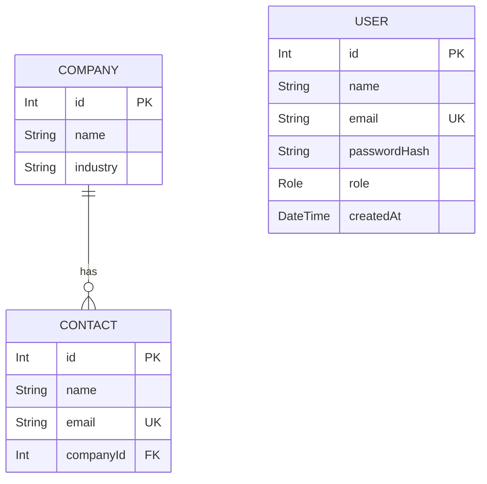

# CRM Backend API

A REST API for a small Customer Relationship Management (CRM) system.

The project manages companies, their contacts, and CRM users. It was built as a backend learning project using Node.js, Express, PostgreSQL, and Prisma.

## Tech Stack

- Node.js
- Express.js
- PostgreSQL
- Prisma ORM
- JSON Web Tokens (JWT)
- bcrypt
- CORS
- express-rate-limit

## Features

- Create, read, update, and delete companies
- Create, read, update, and delete contacts
- Companies can have multiple contacts
- User management for administrators
- JWT-based authentication
- Role-based authorization
- Password hashing with bcrypt
- Centralized error handling
- CORS configuration
- API and login rate limiting

## Entity Relationship Diagram



## User Roles

The API currently supports three roles:

- `ADMIN`
- `SALES`
- `SUPPORT`

All authenticated users can access normal CRM functionality.

Deleting companies or contacts is restricted to `ADMIN`.

User management is also restricted to `ADMIN`.

## Authentication

Users log in through:

`POST /api/auth/login`

Example request:

```json
{
  "email": "user@example.com",
  "password": "password"
}
```

After successful authentication, the API returns a JWT.

Protected endpoints require the token in the Authorization header:

```text
Authorization: Bearer <token>
```

## API Endpoints

### Authentication

| Method | Endpoint          | Access |
| ------ | ----------------- | ------ |
| POST   | `/api/auth/login` | Public |

### Companies

| Method | Endpoint             | Access        |
| ------ | -------------------- | ------------- |
| GET    | `/api/companies`     | Authenticated |
| GET    | `/api/companies/:id` | Authenticated |
| POST   | `/api/companies`     | Authenticated |
| PATCH  | `/api/companies/:id` | Authenticated |
| DELETE | `/api/companies/:id` | ADMIN         |

Example company request:

```json
{
  "name": "Acme Corp",
  "industry": "Technology"
}
```

### Contacts

| Method | Endpoint            | Access        |
| ------ | ------------------- | ------------- |
| GET    | `/api/contacts`     | Authenticated |
| GET    | `/api/contacts/:id` | Authenticated |
| POST   | `/api/contacts`     | Authenticated |
| PATCH  | `/api/contacts/:id` | Authenticated |
| DELETE | `/api/contacts/:id` | ADMIN         |

Example contact request:

```json
{
  "name": "Anna Example",
  "email": "anna@example.com",
  "companyId": 1
}
```

### Users

All user management endpoints require the `ADMIN` role.

| Method | Endpoint         |
| ------ | ---------------- |
| GET    | `/api/users`     |
| GET    | `/api/users/:id` |
| POST   | `/api/users`     |
| PATCH  | `/api/users/:id` |
| DELETE | `/api/users/:id` |

Example user request:

```json
{
  "name": "Sales User",
  "email": "sales@example.com",
  "password": "example-password",
  "role": "SALES"
}
```

## Security

The API includes several security measures:

- Passwords are hashed using bcrypt and are never stored as plain text.
- JWTs are used to authenticate protected requests.
- Role-based authorization restricts sensitive operations.
- CORS restricts browser access to the configured frontend origin.
- General API rate limiting allows a maximum of 100 requests per 10 minutes.
- Login attempts are limited to 5 requests per 15 minutes.
- Environment variables are used for sensitive configuration.
- Invalid requests and database errors are handled through centralized error handling.

## HTTP Status Codes

The API uses standard HTTP status codes, including:

| Status | Meaning                            |
| ------ | ---------------------------------- |
| `200`  | Successful request                 |
| `201`  | Resource created                   |
| `204`  | Resource deleted successfully      |
| `400`  | Invalid request                    |
| `401`  | Authentication required or invalid |
| `403`  | Authenticated but not authorized   |
| `404`  | Resource or route not found        |
| `409`  | Resource conflict                  |
| `429`  | Too many requests                  |
| `500`  | Internal server error              |

## Setup

Install dependencies:

```bash
npm install
```

Create a `.env` file with the required environment variables:

```env
PORT=3000
DATABASE_URL="your_postgresql_connection_string"
JWT_SECRET="your_secret_key"
```

Run the Prisma migrations:

```bash
npx prisma migrate dev
```

Start the API:

```bash
npm start
```

The API will run by default at:

```text
http://localhost:3000
```

## Project Structure

```text
CRM-Backend/
├── prisma/
│   ├── migrations/
│   ├── schema.prisma
│   └── seed.js
├── src/
│   ├── authControllers/
│   ├── companyControllers/
│   ├── contactsControllers/
│   ├── userControllers/
│   ├── middleware/
│   ├── routes/
│   ├── prisma.js
│   └── server.js
├── .env
├── .gitignore
├── package.json
└── README.md
```

## Development Status

This project currently provides the backend foundation for a CRM application. A frontend can be connected to the REST API in a later development stage.
